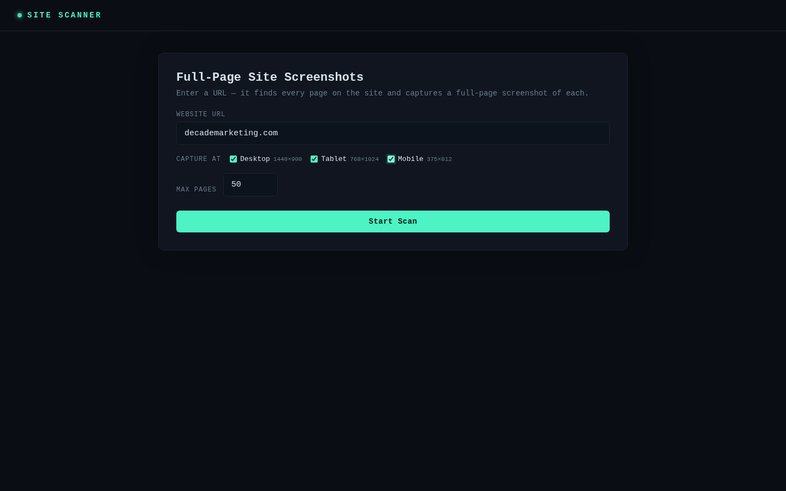
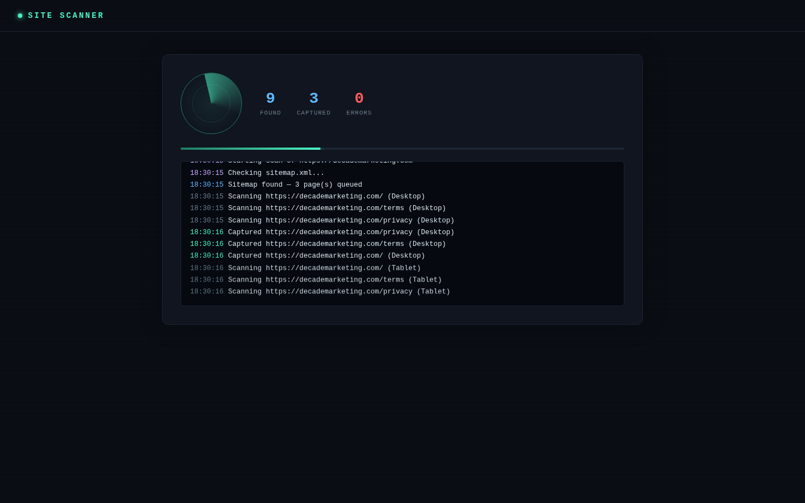
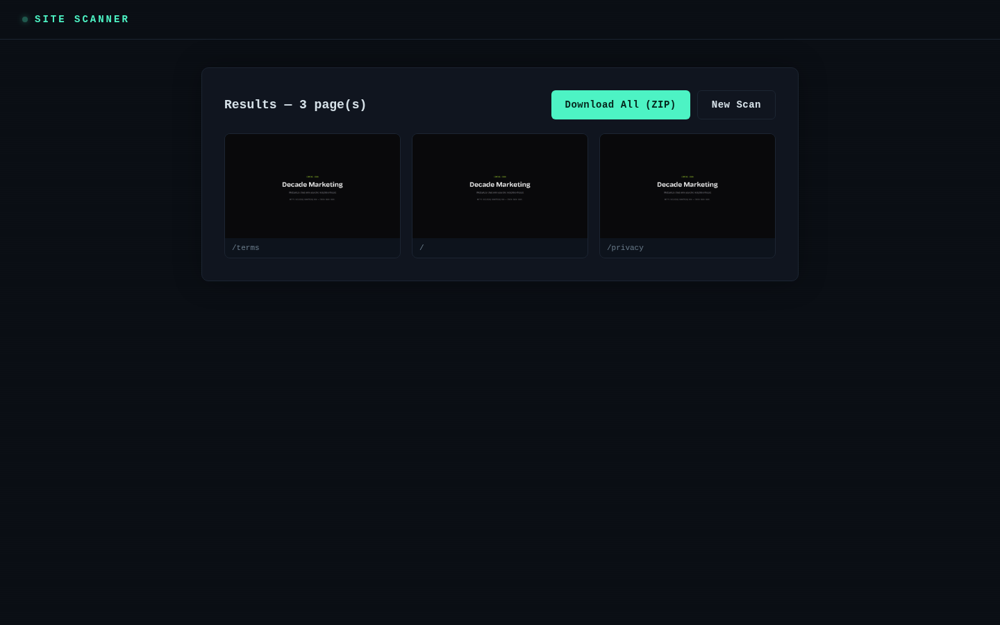

# Site Screenshot Scanner

Full-page screenshots of an entire website, from a single URL. Free and self-hosted, with no account, no API key, and no per-screenshot charge. No page list to maintain either. Point it at a URL, public or local, and it finds every page itself, unlike most screenshot tools where you supply each page's URL one at a time.



## Quick start

Requirements: Node.js 18+ and about 500MB free for the bundled Chromium download.

```bash
git clone https://github.com/JackB2003/site-screenshot-scanner.git
cd site-screenshot-scanner
npm install
npx playwright install --with-deps chromium
npm start
```

Open `http://localhost:3012`, enter a URL, and watch it go. That's the whole setup.

Want a different port?

```bash
PORT=8080 npm start
```

## Using it

1. Open the app in your browser.
2. Enter a URL and, optionally, a max page count.
3. Watch pages get discovered and captured live.
4. Click any thumbnail for a full-size view, or download everything as a ZIP.

### Scanning a local site

You don't need a live public domain. Anything the machine running this tool can reach works, including a site running on your own computer.

Type the full address with `http://` (not just a bare domain) so it isn't mistaken for a public site and upgraded to `https://`:

```
http://localhost:3000
http://127.0.0.1:8080
http://192.168.1.50:5173
```

If your local dev server doesn't have a sitemap.xml (most don't), the scanner automatically falls back to crawling links from the homepage, so it still finds every page on its own.

## Features

- **Zero-config discovery.** Reads `sitemap.xml` / `sitemap_index.xml` first, including nested sitemap indexes. No sitemap? It falls back to crawling links from the homepage, so it works on SPAs and JS-rendered sites too, not just static HTML.
- **True full-page capture.** Auto-scrolls each page before shooting so lazy-loaded content, images, and long layouts are captured in full, not just the first viewport.
- **Live progress.** A Server-Sent Events stream drives a terminal-style log and running counters (found / captured / errors) as the scan happens.
- **Gallery + ZIP export.** Thumbnails populate as each page finishes. Download everything as a single ZIP when the scan completes.
- **Same-domain safe.** Only follows links on the target's own domain, and automatically skips non-page assets (images, PDFs, stylesheets, scripts, fonts, media).
- **Configurable scope.** Cap a scan anywhere from 1 to 200 pages per run.

## How this compares to other screenshot tools

Most website screenshot tools are paid APIs: you sign up, get an API key, and pay per screenshot. [Urlbox](https://urlbox.com/pricing), [ScreenshotOne](https://screenshotone.com/), [URL2PNG](https://www.url2png.com/), and similar services typically start around $17 to $49 a month for a few thousand images, and every one of them expects you to already know and submit each page's URL. Finding the pages is left to you.

The few free tools that will crawl a whole site on their own tend to be a browser extension you run tab by tab, or a small unmaintained script. Neither gives you a live progress view, a gallery, or a one-click ZIP of the results.

| | Site Screenshot Scanner | Typical screenshot APIs |
|---|---|---|
| Cost | Free, self-hosted | Paid, billed per screenshot |
| Page discovery | Finds every page itself (sitemap + link crawl) | You supply each URL yourself |
| Setup | Clone and run | Sign up, get an API key |
| Full-site scan | Point it at a URL, public or local | One request per page, every time |
| Output | Live gallery + one-click ZIP | Raw image files or URLs, one per request |

## Screenshots

| Discovering & capturing | Results gallery |
|---|---|
|  |  |

## How it works

1. **Discovery.** Checks `/sitemap.xml` and `/sitemap_index.xml` first, following nested sitemap indexes up to 20 child sitemaps. If neither exists, it falls back to a breadth-first crawl from the homepage, using the rendered DOM (via Playwright) rather than raw HTML, so links revealed by client-side JavaScript are still found. It also opens common nav/menu buttons to surface links hidden behind dropdowns.
2. **Capture.** Every discovered URL is opened in a real Chromium browser, scrolled to the bottom to trigger lazy-loaded content, then captured with `fullPage: true`.
3. **Streaming feedback.** Every step (page found, page captured, error) is pushed to the browser in real time over SSE, so long scans aren't a silent wait.
4. **Export.** Screenshots are served individually or bundled into a ZIP on demand.

## Tech stack

- **Backend:** Node.js + Express, [Playwright](https://playwright.dev/) (Chromium) for rendering and capture
- **Frontend:** Plain HTML/CSS/JS, no framework, no build step
- **Streaming:** Server-Sent Events for scan progress
- **Packaging:** `archiver` for on-demand ZIP export

## API

| Method | Path | Description |
|---|---|---|
| `POST` | `/api/scan` | Start a scan. Body: `{ "url": string, "maxPages"?: number }`. Returns `{ jobId }`. |
| `GET` | `/api/scan/:id/events` | SSE stream of scan progress for a job. |
| `GET` | `/api/scan/:id/shots/:file` | Fetch a single captured screenshot. |
| `GET` | `/api/scan/:id/zip` | Download all screenshots for a job as a ZIP. |

Scan jobs are held in memory and expire automatically 24 hours after completion.

## Deployment note

This tool fetches and renders whatever URL a user submits. That's the entire point when you're scanning your own sites. If you deploy it somewhere publicly reachable, put it behind authentication (or an IP allowlist) rather than exposing it to anonymous traffic on the open internet. An unauthenticated instance would let anyone make your server issue outbound requests.

## License

[MIT](LICENSE)
